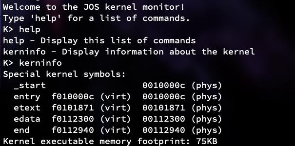
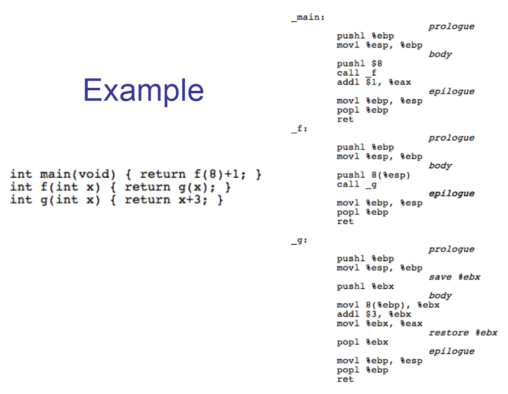

### 环境配置

ubuntu 16.04 32bit

首先安装有关工具

`apt-get update`

`mkdir ~/6.828`
`cd ~/6.828`

`git clone https://github.com/mit-pdos/6.828-qemu.git qemu`

`./configure --disable-kvm --disable-werror --target-list="i386-softmmu x86_64-softmmu"`

`sudo apt-get install libsdl1.2-dev libtool-bin libglib2.0-dev libz-dev libpixman-1-dev`

`make && make install`

### Lab1

clone项目

`mkdir ~/6.828`
`cd ~/6.828`
`git clone https://pdos.csail.mit.edu/6.828/2018/jos.git lab`
`cd lab`

运行qemu-nox（qemu为有GUI版本，对于Linux Server需要运行qemu-nox）

`make qemu-nox`

运行成功



按下ctrl+a，再按x可以退出

#### Part 1: PC Bootstrap

物理空间内存地址可以由下图描述：

```
+------------------+  <- 0xFFFFFFFF (4GB)
|      32-bit      |
|  memory mapped   |
|     devices      |
|                  |
/\/\/\/\/\/\/\/\/\/\

/\/\/\/\/\/\/\/\/\/\
|                  |
|      Unused      |
|                  |
+------------------+  <- depends on amount of RAM
|                  |
|                  |
| Extended Memory  |
|                  |
|                  |
+------------------+  <- 0x00100000 (1MB)
|     BIOS ROM     |
+------------------+  <- 0x000F0000 (960KB)
|  16-bit devices, |
|  expansion ROMs  |
+------------------+  <- 0x000C0000 (768KB)
|   VGA Display    |
+------------------+  <- 0x000A0000 (640KB)
|                  |
|    Low Memory    |
|                  |
+------------------+  <- 0x00000000
```

> Familiarize yourself with the assembly language materials available on the 6.828 reference page. You don't have to read them now, but you'll almost certainly want to refer to some of this material when reading and writing x86 assembly.
> We do recommend reading the section "The Syntax" in Brennan's Guide to Inline Assembly. It gives a good (and quite brief) description of the AT&T assembly syntax we'll be using with the GNU assembler in JOS.

开两个终端：
（都是在lab/中）
一个`make qemu-nox-gdb`
一个`make gdb`
就可以进入调试窗口


Exercise 3:

在gdb窗口看到了`[f000:fff0]    0xffff0:	ljmp   $0xf000,$0xe05b`，这个是第一条指令

这条指令说明执行的起始物理地址为$0xf000

前面[f000:fff0]分别表示代码寄存器CS内容为f000，指针寄存器IP内容为fff0，8086CPU会从内存CS*16+IP的位置开始，读取并执行一条指令。

当前情况下就是 16 * 0xf000 + 0xfff0 = 0xf0000 + 0xfff0 = oxffff0

ljmp是跳转指令，CS不变还是0xf000，IP从0xfff0跳到0xe05b

### Part 2: The Boot Loader

在地址0x7c00处设置断点，然后c运行到断点处，使用x/i来查看当前指令
```bash
(gdb) b *0x7c00
Breakpoint 1 at 0x7c00
```

```bash
(gdb) c
Continuing.
[   0:7c00] => 0x7c00:	cli

Breakpoint 1, 0x00007c00 in ?? ()
```

```bash
(gdb) x/i
   0x7c01:	cld
```

```bash
(gdb) x/16i
   0x7c12:	out    %al,$0x64
   0x7c14:	in     $0x64,%al
   0x7c16:	test   $0x2,%al
   0x7c18:	jne    0x7c14
   0x7c1a:	mov    $0xdf,%al
   0x7c1c:	out    %al,$0x60
   0x7c1e:	lgdtw  0x7c64
   0x7c23:	mov    %cr0,%eax
   0x7c26:	or     $0x1,%eax
   0x7c2a:	mov    %eax,%cr0
   0x7c2d:	ljmp   $0x8,$0x7c32
   0x7c32:	mov    $0xd88e0010,%eax
   0x7c38:	mov    %ax,%es
   0x7c3a:	mov    %ax,%fs
   0x7c3c:	mov    %ax,%gs
   0x7c3e:	mov    %ax,%ss
```

#### Exercise 3

> At what point does the processor start executing 32-bit code? What exactly causes the switch from 16- to 32-bit mode?

在`0x7c2d:	ljmp   $0x8,$0x7c32`指令之后，地址从16位变为了32位形式
代码在`boot/boot.S`中，还有注释：
```bash
# Jump to next instruction, but in 32-bit code segment.
# Switches processor into 32-bit mode.
ljmp    $PROT_MODE_CSEG, $protcseg
```

> What is the last instruction of the boot loader executed, and what is the first instruction of the kernel it just loaded?

boot loader的最后一条就在`boot/main.c`中：
`((void (*)(void)) (ELFHDR->e_entry))();`

在`kern/entry.S`中能找到第一条指令，其地址为`0x0010000c`，和kernel信息中的起始地址一致
```bash
entry:
	movw	$0x1234,0x472			# warm boot
```

> Where is the first instruction of the kernel?

第一条指令是`movw $0x1234,0x472`，地址为`0x0010000c`

> How does the boot loader decide how many sectors it must read in order to fetch the entire kernel from disk? Where does it find this information?

`boot/main.c`中有代码，可以通过`ELFHDR->e_phnum`来获取扇区数量
通过`objdump -h obj/kern/kernel`可以获得kernel信息

#### Loading the kernel

ELF文件头
.text段：存放所有程序的可执行代码
.rodata段：存放所有只读数据的数据段，比如字符串常量。
.data段：存放所有被初始化过的数据段，比如有初始值的全局变量

```bash
root@ubuntu-jos:~/6.828/lab# objdump -h obj/kern/kernel

obj/kern/kernel:     file format elf32-i386

Sections:
Idx Name          Size      VMA       LMA       File off  Algn
  0 .text         00001871  f0100000  00100000  00001000  2**4
                  CONTENTS, ALLOC, LOAD, READONLY, CODE
  1 .rodata       00000714  f0101880  00101880  00002880  2**5
                  CONTENTS, ALLOC, LOAD, READONLY, DATA
  2 .stab         000038d1  f0101f94  00101f94  00002f94  2**2
                  CONTENTS, ALLOC, LOAD, READONLY, DATA
  3 .stabstr      000018bb  f0105865  00105865  00006865  2**0
                  CONTENTS, ALLOC, LOAD, READONLY, DATA
  4 .data         0000a300  f0108000  00108000  00009000  2**12
                  CONTENTS, ALLOC, LOAD, DATA
  5 .bss          00000648  f0112300  00112300  00013300  2**5
                  CONTENTS, ALLOC, LOAD, DATA
  6 .comment      00000035  00000000  00000000  00013948  2**0
                  CONTENTS, READONLY
```

```bash
root@ubuntu-jos:~/OSCD/JOS# objdump -x obj/kern/kernel

obj/kern/kernel:     file format elf32-i386
obj/kern/kernel
architecture: i386, flags 0x00000112:
EXEC_P, HAS_SYMS, D_PAGED
start address 0x0010000c

Program Header:
    LOAD off    0x00001000 vaddr 0xf0100000 paddr 0x00100000 align 2**12
         filesz 0x0000763c memsz 0x0000763c flags r-x
    LOAD off    0x00009000 vaddr 0xf0108000 paddr 0x00108000 align 2**12
         filesz 0x0000a94c memsz 0x0000a94c flags rw-
   STACK off    0x00000000 vaddr 0x00000000 paddr 0x00000000 align 2**4
         filesz 0x00000000 memsz 0x00000000 flags rwx

Sections:
...

SYMBOL TABLE:
...
```

#### Exercise 5

> Change the link address in boot/Makefrag to something wrong, run make clean, recompile the lab with make, and trace into the boot loader again to see what happens. Don't forget to change the link address back and make clean again afterward!

查看`boot/Makefrag`，找到-Ttext后面的入口地址`start -Ttext 0x7C00`
把0x7C00修改为另一个值，让其错误，比如改为`0x7C04`

`make clean`并重新`make`后再次开启gdb调试
同样在`b *0x7c00`处打上断点并运行到此，`ci`当运行到`0:7c2d`处时发生报错
```bash
(gdb) si
[   0:7c2d] => 0x7c2d:	ljmp   $0x8,$0x7c36
0x00007c2d in ?? ()
```
```bash
DR6=ffff0ff0 DR7=00000400
EFER=0000000000000000
Triple fault.  Halting for inspection via QEMU monitor.
```
后面的`0x7c36`地址比正确地址多了4，而BIOS 将 boot loader固定加载在`0x7c00`开始的地方，所以这次的跳转就发生了错误

#### Exercise 6

> Examine the 8 words of memory at 0x00100000 at the point the BIOS enters the boot loader, and then again at the point the boot loader enters the kernel. Why are they different? What is there at the second breakpoint?

`0x00100000`是从BIOS进入到boot loader的地址查看`0x00100000`处的8个word的值

```bash
(gdb) x/8x 0x00100000
0x100000:	0x00000000	0x00000000	0x00000000	0x00000000
0x100010:	0x00000000	0x00000000	0x00000000	0x00000000
```

程序的入口点是`0x10000c`，在此处打断点，看后面的8个字
```bash
0x100000:	0x1badb002	0x00000000	0xe4524ffe	0x7205c766
0x100010:	0x34000004	0x0000b812	0x220f0011	0xc0200fd8
```

### Part 3 The Kernel
进入内核后，JOS主要进行了
1. 开启分页模式，将虚拟地址[0, 4MB)映射到物理地址[0, 4MB)，[0xF0000000, 0xF0000000+4MB)映射到[0, 4MB）（/kern/entry.S）
1. 在控制台输出字符串（/kern/init.c）
1. 测试函数的调用过程 （/kern/init.c）

#### 开启分页模式
操作系统经常被加载到高虚拟地址处，比如0xf0100000，但是并不是所有机器都有这么大的物理内存。可以使用内存管理硬件做到将高地址虚拟地址映射到低地址物理内存。

#### 格式化输出到控制的台
这一小结提供了一些函数，用于将字符串输出到控制台。这些函数分布在kern/printf.c, lib/printfmt.c, kern/console.c中。可以发现真正实现字符串输出的是vprintfmt()函数，其他函数都是对它的包装。vprintfmt()函数很长，大的框架是一个while循环，while循环中首先会处理常规字符。
```C
while ((ch = *(unsigned char *) fmt++) != '%') {        //先将非格式化字符输出到控制台。
            if (ch == '\0')                                     //如果没有格式化字符直接返回
                return;
            putch(ch, putdat);
        }
```
#### Exercise 8
在`vprintfmt()`中找到case 'o'的地方
```C
// 从ap指向的可变字符串中获取输出的值
            num = getuint(&ap, lflag);
            //设置基数为8
            base = 8;
            goto number;
```

#### 栈
1. 执行call指令前，函数调用者将参数入栈，按照函数列表从右到左的顺序入栈。
1. call指令会自动将当前eip入栈，ret指令将自动从栈中弹出该值到eip寄存器。
1. 被调用函数负责：将ebp入栈，esp的值赋给ebp。

#### Exercise 11
`mon_backtrace()`
```C
int mon_backtrace(int argc, char **argv, struct Trapframe *tf)
{
    // Your code here.
    uint32_t *ebp = (uint32_t *)read_ebp(); //获取ebp的值
    while (ebp != 0) {                      //终止条件是ebp为0
        //打印ebp, eip, 最近的五个参数
        uint32_t eip = *(ebp + 1);
        cprintf("ebp %08x eip %08x args %08x %08x %08x %08x %08x\n", ebp, eip, *(ebp + 2), *(ebp + 3), *(ebp + 4), *(ebp + 5), *(ebp + 6));
        //更新ebp
        ebp = (uint32_t *)(*ebp);
    }
    return 0;
}
```

#### Exercise 12
完善 Exercise 11
```C
int mon_backtrace(int argc, char **argv, struct Trapframe *tf)
{
    // Your code here.
    uint32_t *ebp = (uint32_t *)read_ebp();
    struct Eipdebuginfo eipdebuginfo;
    while (ebp != 0) {
        //打印ebp, eip, 最近的五个参数
        uint32_t eip = *(ebp + 1);
        cprintf("ebp %08x eip %08x args %08x %08x %08x %08x %08x\n", ebp, eip, *(ebp + 2), *(ebp + 3), *(ebp + 4), *(ebp + 5), *(ebp + 6));
        //打印文件名等信息
        debuginfo_eip((uintptr_t)eip, &eipdebuginfo);
        cprintf("%s:%d", eipdebuginfo.eip_file, eipdebuginfo.eip_line);
        cprintf(": %.*s+%d\n", eipdebuginfo.eip_fn_namelen, eipdebuginfo.eip_fn_name, eipdebuginfo.eip_fn_addr);
        //更新ebp
        ebp = (uint32_t *)(*ebp);
    }
    return 0;
}
```